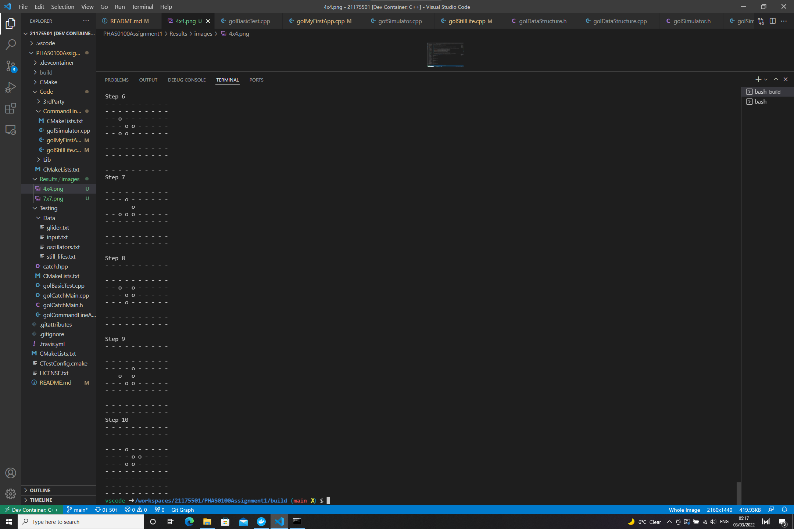
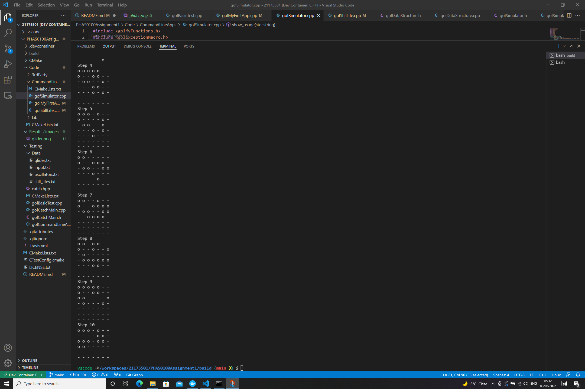
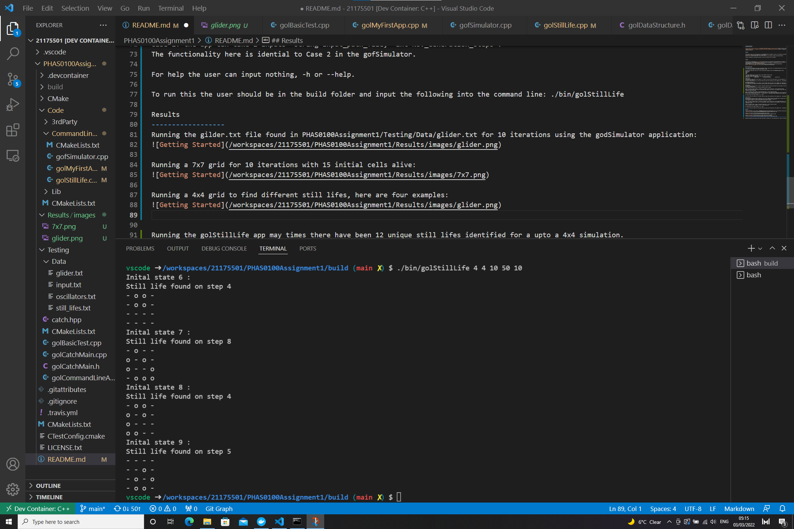

PHAS0100ASSIGNMENT1
------------------

[](https://travis-ci.com/[USERNAME]/PHAS0100Assignment1)
[](https://ci.appveyor.com/project/[USERNAME]/PHAS0100Assignment1)


Purpose
-------

This project serves as a starting point for the PHAS0100 2021/22 Assignment 1 Game of Life Simulation coursework. It has a reasonable folder structure for [CMake](https://cmake.org/) based projects,
that use [CTest](https://cmake.org/) to run unit tests via [Catch](https://github.com/catchorg/Catch2). 

This is project is to simulate the game of life using c++;
Conway's game of life adhears to the following rules:
1, All alive cells with 2 or 3 alive neighbours stay alive.
2, All alive cells with less than 2 or more than 3 alive neighbours become dead.
3, All dead cells with 3 alive neighbours become alive.
4, All other cells stay dead.

In this project two command line applications have been created that the user can interface with.
gofSimulator           golStillLife 

gofSimulator allows the user to specify a simulation size and the number of alive cells and then runs a simulation for a inputed amount of iterations.
gofSimulator also allows for a path to be inputed which points to some file containing a specific game of life stucutre.

golStillLife allows the user to test a desierd amount of random instantiations and then the application finds the still lifes that emerge.
golStillLife also allows for a path input.


Credits
-------

This project is maintained by [Dr. Jim Dobson](https://www.ucl.ac.uk/physics-astronomy/people/dr-jim-dobson). It is based on [CMakeCatch2](https://github.com/UCL/CMakeCatch2.git) that was originally developed as a teaching aid for UCL's ["Research Computing with C++"](http://rits.github-pages.ucl.ac.uk/research-computing-with-cpp/)
course developed by [Dr. James Hetherington](http://www.ucl.ac.uk/research-it-services/people/james)
and [Dr. Matt Clarkson](https://iris.ucl.ac.uk/iris/browse/profile?upi=MJCLA42).


Build Instructions
------------------
This project was developed using Ubuntu 20.04 docker image, using the g++ 9.3.0 complier(enforcing C++ 17) and CMake 3.16.3.
To run this project make sure the same environment is used.

To build this application you must run the following bash commands inside the PHAS0100Assignment1 folder:
```console
mkdir build
cd build
cmake ..
make
```

Once these commands are run you can then run and command line apps using:
./bin/name of the command line app
there are 4 command line applications that a user can run, they are:
```console
./bin/gofSimulator            
./bin/golBasicTest           
./bin/golCommandLineArgsTest           
./bin/golStillLife
```  

golBasicTest:
this command line app takes no user inputs. It is used to run unit tests using catch2 to test the behaviour of the class's and functions created in this project.
To run this the user should be in the build folder and input the following into the command line: 
```console
./bin/golBasicTest
```

golCommandLineArgsTetst: 
This command line app takes no user unputs. It also contains some unit tests for the command line application.
To run this the user should be in the build folder and input the following into the command line: 
```console
./bin/golCommandLineArgsTetst
```

gofSimulator:
This application allows the user to evolve a specified simulation and each iteration will be printed to the consle with a delay so the user can see how the system evolves.
This command line app is set up to take two different cases of inputs.

Case 1: the app can take 5 inputs " int Rows, int Columns, int No._Alive_Cells, int No._Generation_steps".
Where the user can define the size of the simulation their game of life will be, the number of alive cells and the number of times the simulation should be evolved.

Case 2: the app can take 2 inputs "string Input_path_file,  int No._Generation_steps".
Where the user needs to define the path of the file they want to be read into the application and the number of times it should be evolved.
The file should represent dead cells as '-', alive cells as 'o' and should contain nothing else but spaces and line breaks.

For help the user can input nothing, -h or --help.

To run this the user should be in the build folder and input the following into the command line: 
```console
./bin/gofSimulator
```

golStillLife:
This application allows the user to search for still life's (objects that do not change when a evolution set is taken).
The user has the ability to specify the number of still lifes they want to seach for.
This command line app is set up to take two different cases of inputs.

Case 1: the app can take 6 inputs " int Rows, int Columns, int No._Alive_Cells, int No._Generation_steps, int, int No._Inital_test_conditions"
This case is much like the first case of the gofSimulator app but contains an extra argument on the end which specifies the number of initial conditions to test.

Case 2: the app can take 2 inputs "string Input_path_file,  int No._Generation_steps".
The functionality here is idential to Case 2 in the gofSimulator.

For help the user can input nothing, -h or --help.

To run this the user should be in the build folder and input the following into the command line: 
```console
./bin/golStillLife
```

Results
------------------
Running the gilder.txt file found in PHAS0100Assignment1/Testing/Data/glider.txt for 10 iterations using the godSimulator application:


Running a 7x7 grid for 10 iterations with 15 initial cells alive:


Running a 4x4 grid to find different still lifes, here are four examples:


Running the golStillLife app may times there have been 12 unique still lifes identified for a upto a 4x4 simulation.
